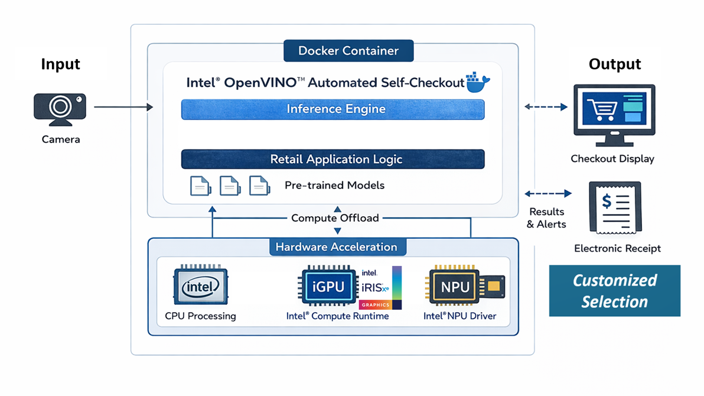

# Intel® OpenVINO™ Retail Demo — Automated Self-Checkout

This repository provides a simplified, containerized quick-start guide for running the **Intel® Automated Self-Checkout** retail demo using [Intel® OpenVINO™](https://www.intel.com/content/www/us/en/developer/tools/openvino-toolkit/overview.html). It packages the essential runtime pieces into a *Docker-based* workflow so you can launch the scenario quickly on Ubuntu without spending time assembling dependencies or reproducing the full build process from the upstream project.

The primary goal is to help developers, solution engineers, and demo operators get a self-checkout scenario running in minutes across common Intel targets — CPU for baseline validation, iGPU for higher throughput, and NPU where available for additional acceleration. The guide focuses on predictable `“pull and run”` steps plus minimal host prerequisites (Docker setup and, if needed, device/driver enablement for accelerators).

Unlike the upstream reference implementation, which is designed for full-feature development and may require building and configuring the pipeline from source, this repo emphasizes speed and repeatability for demos and evaluations. If you need deeper customization, model/pipeline changes, or end-to-end development workflows, use the upstream repository as the [canonical](https://canonical.com/) reference and treat this project as the fastest on-ramp to a working demo.



---

## Upstream Reference

This work is based on the official Intel retail reference implementation:

- [**Intel® Automated Self-Checkout Reference Package**](https://github.com/intel-retail/automated-self-checkout/tree/1d77763d086963bef754471938ebd30772615f3e)

---

## Prerequisites

### Operating System

- Ubuntu [24.04 LTS](https://ubuntu.com/download/desktop) (with recommended Linux* distribution)  
  

### Docker

- Install [Docker Engine](https://docs.docker.com/engine/install/ubuntu/)
- Perform Linux post-installation steps - [configure Docker as non-root user](https://docs.docker.com/engine/install/linux-postinstall/)
- Utilizing [Docker Compose](https://docs.docker.com/compose/) to unlocking a streamlined and efficient development and deployment.

### OpenVINO™ Device Support 

Depending on your hardware, configure one or more of the following:

- **Intel® iGPU (OpenVINO™ GPU)**  
  https://github.com/intel/compute-runtime
- **Intel® NPU (OpenVINO™ NPU)**  
  https://github.com/intel/linux-npu-driver

> 💡 It is recommended to start with **CPU mode** first to validate the environment and container startup.

---

## Quick Start

### Step 1 — To Disables Access Control for the X Server

This is to allow any X client from any host to connect to and display applications on your screen.
```bash
xhost +
```
You shoule be able to see outputs from the console`access control disabled, clients can connect from any host`

### Step 2 — Pull the Image

```bash
docker pull harbor.edgesync.cloud/intel/openvino-retail-self-checkout-ai:2026.3.1
```

### Step 3 — Run

```bash
docker compose up
```


---

## Notes & Disclaimers

- **Upstream project**: Intel® Automated Self-Checkout Reference Package

- **Docker documentation**: Docker docs (installation & post-installation)

- The upstream repository includes additional licensing and disclaimer notes
(e.g., GStreamer licensing, third-party datasets, and models).
These may apply depending on how the demo is built and distributed.
